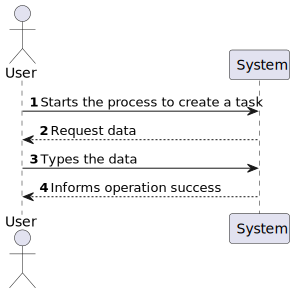
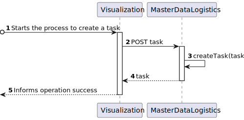
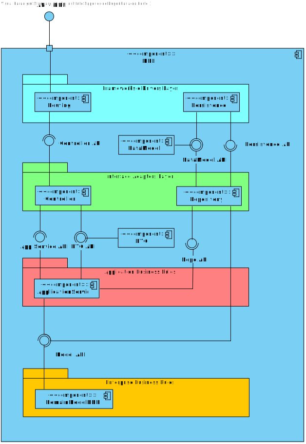
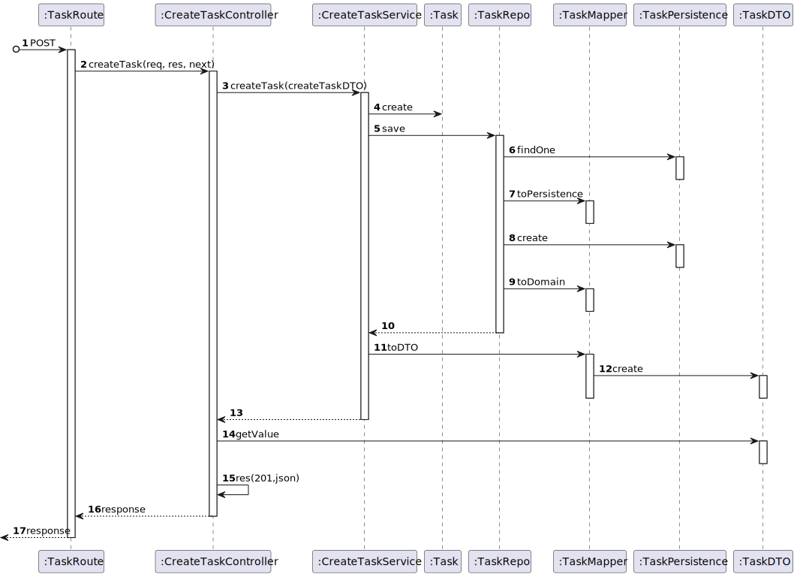
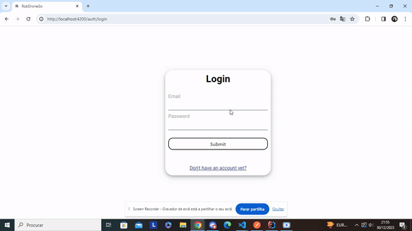

# US 460 - As the system user I intend to request a task, specify the parameters necessary for its execution, namely the starting point and term point and what is the intended task

## 1. Context

* First time that this user story is being implemented.
* This task is relative to system user.

## 2. Requirements

**US 460 -** As the system user I intend to request a task, specify the parameters necessary for its execution, namely the starting point and term point and what is the intended task

**Dependencies:**
- none

### Client Questions
> **Q**: Em relação às tarefas existentes (vigilância de um piso e transporte de um objeto) existem algum requerimento especial? Para além da especificação do piso na vigilância e especificação do objeto e local de recolha e entrega no caso do transporte. <br>
> **A**: As tarefas de vigilância caracterizam-se por indicar qual o edificio e piso(s) que se pretende vigiar bem como o número de contacto em caso de incidente. tipicamente o segurança irá requisitar que um robot "dê uma volta pelos pisos X, Y e Z do edificio N". <br> As tarefas de "piclup & delivery" caracterizam-se por indicar qual a sala que se pretende de pickup e qual a sala de delivery, bem como um nome e um contacto para pickup e outro para delivery. deve também ser indicado um código de confirmação que a pessoa que receberá deverá introduzir no painel do robot. adicionalmente deve ser indicada uma descrição da entrega, ex., "Marcadores de cor vermelha (1x) e azul (2x)"

> **Q**: Gostaríamos de saber se pretende que fique registado qual foi o utente que requisitou a tarefa. <br>
> **A**: sim. o requerente é uma informação importante a manter. <br>

> **Q**: Na tarefa de Supervision deve ser indicado um contacto para o qual deve ser enviada uma mensagem em caso de necessidade. Este contacto pode/deve ser o do utente que faz a requisição da tarefa? Por exemplo, se um segurança pedir esta tarefa, e em caso de necessidade de contacto, o robot contacta o mesmo segurança que foi quem fez o pedido e é quem deve obter informações acerca da tarefa. A mesma questão aplica-se à tarefa de Pickup & Delivery onde o contacto de pickup pode/deve ser o do utilizador que faz a requisição da tarefa, passando apenas o contacto de delivery. <br>
> **A**: O utilizador pode introduzir um contacto que não o dele. exemplo, o docente ABC requista a recolha de uma caneta na secretaria do departamento indicando o contacto de XYZ para entrega na sala de aula XXX ao docente ASD. <br>

> **Q**: O contacto indicado pelo utilizador deve ser o e-mail ou número de telemóvel? <br>
> **A**: na requisição de uma tarefa será necessário indicar um contacto de "pickup" e um contacto de "delivery" (nome e número de telefone <br>

> **Q**: Relativamente ao 'Código de Confirmação', mencionado em https://moodle.isep.ipp.pt/mod/forum/discuss.php?d=25045#p31683, gostava de perceber se este código segue algum formato específico. Além disso, o código será introduzido pelo utilizador que está a requisitar a tarefa, ou deverá ser gerado automaticamente pelo sistema? <br>
> **A**: o código de confirmação é introduzido pelo requisitante. é um número entre 4 e 6 digitos <br>

> **Q**: Gostávamos de saber se a descrição de entrega deve ter algum limite de caracteres? <br>
> **A**: para a descrição devem limitar a 1000 caracteres alfanumericos <br>

> **Q**: Foi-nos dito, no contexto de ALGAV (modulo de planeamento), que "Nas tarefas do tipo vigilância ou desinfeção os pontos iniciais e finais de cada tarefa estão sempre no mesmo corredor interno de um piso de um edifício". No entanto, numa resposta anterior "As tarefas de vigilância caracterizam-se por indicar qual o edifício e piso(s)" <br>
> **A**: Sim podem considerar as tarefas de vigilância apenas para um piso e o utilizador terá que criar uma requisição para cada piso. <br>

> **Q**: em relação ao processo da criação da tarefa, o cliente aceita que a tarefa tenha um estado "requisitado" ou entende que o processo se divide em duas etapas distintas: requisição da tarefa e depois a criação da tarefa propriamente dita? <br>
> **A**: o processo de negócio é o seguinte:
1.utente efetua requisição de tarefa,
2.gestor de tarefas aprova requisição,
3.gestor de tarefas inicia o planeamento das tarefas aprovadas <br>

> **Q**: Perante este caso de uso, o quê que identificaria uma Tarefa? Podem haver várias tarefas com os mesmos detalhes no sistema? <br>
> **A**: em relação à segunda pergunta, sim, é perfeitamente possivel um utente fazer duas requisições com as mesmas caracteristicas<br>


## 3. Analysis

**Analyzing this User Story we understand that:**
* Task is a request made by a user to the system to perform a certain action.
* The task can be of two types: Surveillance and Pickup & Delivery
* Surveillance task is a request made by a user to the system to perform a surveillance action in a certain building floor.
* The surveillance task information is based on: Task Type, Task Description, Task Building, Task Floor, Task Contact
* Pickup & Delivery task is a request made by a user to the system to perform a pickup & delivery action in a certain building floor.
* The pickup & delivery task information is based on: Task Type, Task Description, Task Pickup Contact, Task Delivery Contact, Task Pickup Code, Task Pickup Room, Task Delivery Room

* Task example:
```
{
    "taskType": "Surveillance",
    "taskDescription": "Vigilância do piso 1 do edificio B",
    "taskBuilding": "B",
    "taskFloor": "1",
    "taskContact": "912345678"
}
```
```
{
    "taskType": "Pickup & Delivery",
    "taskDescription": "Recolha de caneta na secretaria do departamento",
    "taskPickupContact": "912345678",
    "taskDeliveryContact": "912345678",
    "taskPickupCode": "1234",
    "taskPickupRoom": "Secretaria",
    "taskDeliveryRoom": "Sala de aula 1"
}
```
### 3.1. Domain Model Excerpt


## 4. Design

### 4.1. Realization

### Level1
###### LogicalView:


###### SceneryView:


###### ProcessView:


#### Level2
###### LogicalView:


###### ImplementationView:


###### PhysicalView:


###### ProcessView:


#### Level3
###### LogicalView:


###### ImplementationView:


###### ProcessView:


### 4.3. Applied Patterns
* Controller
* Service
* Repository
* Mapper
* DTO
* GRASP

### 4.4. Tests

**Test 1:** **Ensure that the `Task.create` method successfully creates a Task instance with valid input for an "Object Transport" task.**
```
it('should create a Object transport Task instance with valid input', function () {
        // Arrange
        const taskDTO: ICreateTaskDTO  = {
            "taskDescription" : "Recolha de caneta na secretaria do departamento" ,
            "taskType" : "Object transport" ,
            "taskPickupRoom" : "D112" ,
            "taskDeliveryRoom" : "D113" ,
            "taskPickupContact" : "912345678" ,
            "taskDeliveryContact" : "912345679" ,
            "taskPickupCode" : 1234 ,
            "taskRequester" : "utente@isep.ipp.pt" ,
            "taskRequestDate" : new Date()
        }

        // Act
        const result = Task.create(taskDTO);

        // Assert
        assert.ok(result.isSuccess);
        assert.ok(result.getValue() instanceof Task);
        assert.strictEqual(result.getValue().taskDescription, taskDTO.taskDescription);
        assert.strictEqual(result.getValue().taskType, taskDTO.taskType);
        assert.strictEqual(result.getValue().taskPickupRoom, taskDTO.taskPickupRoom);
        assert.strictEqual(result.getValue().taskDeliveryRoom, taskDTO.taskDeliveryRoom);
        assert.strictEqual(result.getValue().taskPickupContact, taskDTO.taskPickupContact);
        assert.strictEqual(result.getValue().taskDeliveryContact, taskDTO.taskDeliveryContact);
        assert.strictEqual(result.getValue().taskPickupCode, taskDTO.taskPickupCode);
        assert.strictEqual(result.getValue().taskRequester, taskDTO.taskRequester);
        assert.strictEqual(result.getValue().taskRequestDate, taskDTO.taskRequestDate);

    });
```

**Test 2:** **Ensure that the `Task.create` method successfully creates a Task instance with valid input for a "Floor Surveillance" task.**
```
it('should create a Task instance with valid input', function () {
        // Arrange
        const taskDTO: ICreateTaskDTO  = {
            "taskDescription" : "Vigilância do piso 1 do edifício D" ,
            "taskType" : "Floor surveillance" ,
            "taskPickupRoom" : "D112" ,
            "taskDeliveryRoom" : "D113" ,
            "taskBuilding" : "D" ,
            "taskFloor" : 1 ,
            "taskContact" : "912345678" ,
            "taskRequester" : "utente@isep.ipp.pt" ,
            "taskRequestDate" : new Date()
        }

        // Act
        const result = Task.create(taskDTO);

        // Assert
        assert.ok(result.isSuccess);
        assert.ok(result.getValue() instanceof Task);
        assert.strictEqual(result.getValue().taskDescription, taskDTO.taskDescription);
        assert.strictEqual(result.getValue().taskType, taskDTO.taskType);
        assert.strictEqual(result.getValue().taskPickupRoom, taskDTO.taskPickupRoom);
        assert.strictEqual(result.getValue().taskDeliveryRoom, taskDTO.taskDeliveryRoom);
        assert.strictEqual(result.getValue().taskBuilding, taskDTO.taskBuilding);
        assert.strictEqual(result.getValue().taskFloor, taskDTO.taskFloor);
        assert.strictEqual(result.getValue().taskContact, taskDTO.taskContact);
        assert.strictEqual(result.getValue().taskRequester, taskDTO.taskRequester);
        assert.strictEqual(result.getValue().taskRequestDate, taskDTO.taskRequestDate);
    });
```

**Test 3:** **Confirm that the `Task.create` method fails to create a Task instance when an invalid task type is provided.**
```
it('should fail to create a Task instance with task Type', function () {
        // Arrange
        const taskDTO: ICreateTaskDTO  = {
            "taskDescription" : "Vigilância do piso 1 do edifício D" ,
            "taskType" : "Surveillance" ,
            "taskPickupRoom" : "D112" ,
            "taskDeliveryRoom" : "D113" ,
            "taskBuilding" : "D" ,
            "taskFloor" : 1 ,
            "taskContact" : "912345678" ,
            "taskRequester" : "utente@isep.ipp.pt" ,
            "taskRequestDate" : new Date()
        }

        // Act
        const result = Task.create(taskDTO);

        // Assert
        assert.ok(result.isFailure);
        assert.strictEqual(result.errorValue(), "Task not available");
    });
```

**Test 4:** **Confirm that the `Task.create` method fails to create a Task instance when essential data is missing.**
```
it('should fail to create a Task instance with missing data', function () {
        // Arrange
        const taskDTO: ICreateTaskDTO  = {
            "taskDescription" : "Vigilância do piso 1 do edifício D" ,
            "taskType" : "Floor surveillance" ,
            "taskPickupRoom" : "D112" ,
            "taskDeliveryRoom" : "D113" ,
            "taskBuilding" : "D" ,
            "taskContact" : "912345678" ,
            "taskRequester" : "utente@isep.ipp.pt" ,
            "taskRequestDate" : new Date()
        }

        // Act
        const result = Task.create(taskDTO);

        // Assert
        assert.ok(result.isFailure);
        assert.strictEqual(result.errorValue(), "Task data does not match");
    });
```

**Test 5:** **Validate that the `Task.create` method fails when the pickup and delivery rooms are the same.**
```
it('should fail to create a Task instance with same taskPickupRoom and taskDeliveryRoom', function () {
        // Arrange
        const taskDTO: ICreateTaskDTO  = {
            "taskDescription" : "Vigilância do piso 1 do edifício D" ,
            "taskType" : "Floor surveillance" ,
            "taskPickupRoom" : "D112" ,
            "taskDeliveryRoom" : "D112" ,
            "taskBuilding" : "D" ,
            "taskFloor" : 1 ,
            "taskContact" : "912345678" ,
            "taskRequester" : "utente@isep.ipp.pt" ,
            "taskRequestDate" : new Date()
        }

        // Act
        const result = Task.create(taskDTO);

        // Assert
        assert.ok(result.isFailure);
        assert.strictEqual(result.errorValue(), "Pickup and delivery rooms are the same");
    });
```

**Test 6:** **Confirm that the `Task.create` method fails when the task description exceeds the allowed length.**
```
it('should fail to create a Task instance with invalid Description', function () {
        // Arrange
        const taskDTO: ICreateTaskDTO  = {
            "taskDescription" : "Vigilância do piso 1 do edifício D".repeat(100) ,
            "taskType" : "Floor surveillance" ,
            "taskPickupRoom" : "D112" ,
            "taskDeliveryRoom" : "D111" ,
            "taskBuilding" : "D" ,
            "taskFloor" : 1 ,
            "taskContact" : "912345678" ,
            "taskRequester" : "utente@isep.ipp.pt" ,
            "taskRequestDate" : new Date()
        }

        // Act
        const result = Task.create(taskDTO);

        // Assert
        assert.ok(result.isFailure);
        assert.strictEqual(result.errorValue(), "Task description must be 1-1000 characters");
    });
```

**Test 7:** **Confirm that the `Task.create` method fails when an invalid contact number is provided.**
```
it('should fail to create a Task instance with invalid taskContact', function () {
        // Arrange
        const taskDTO: ICreateTaskDTO  = {
            "taskDescription" : "Vigilância do piso 1 do edifício D" ,
            "taskType" : "Floor surveillance" ,
            "taskPickupRoom" : "D112" ,
            "taskDeliveryRoom" : "D111" ,
            "taskBuilding" : "D" ,
            "taskFloor" : 1 ,
            "taskContact" : "9123456781" ,
            "taskRequester" : "utente@isep.ipp.pt" ,
            "taskRequestDate" : new Date()
        }

        // Act
        const result = Task.create(taskDTO);

        // Assert
        assert.ok(result.isFailure);
        assert.strictEqual(result.errorValue(), "Contact number is not valid");
    });
```

**Test 8:** **Ensure that the `Task.create` method fails when either the pickup or delivery contact number is invalid.**
```
it('should fail to create a Task instance with invalid taskPickupContact and taskDeliveryContact', function () {
        // Arrange
        const taskDTO: ICreateTaskDTO  = {
            "taskDescription" : "Recolha de caneta na secretaria do departamento" ,
            "taskType" : "Object transport" ,
            "taskPickupRoom" : "D112" ,
            "taskDeliveryRoom" : "D113" ,
            "taskPickupContact" : "912345678" ,
            "taskDeliveryContact" : "9123456791" ,
            "taskPickupCode" : 1234 ,
            "taskRequester" : "utente@isep.ipp.pt" ,
            "taskRequestDate" : new Date()
        }

        // Act
        const result = Task.create(taskDTO);

        // Assert
        assert.ok(result.isFailure);
        assert.strictEqual(result.errorValue(), "Contact number is not valid");
    });
```

**Test 9:** **Validate that the `Task.create` method fails when an invalid pickup code is provided.**
```
it('should fail to create a Task instance with invalid taskPickupCode', function () {
        // Arrange
        const taskDTO: ICreateTaskDTO  = {
            "taskDescription" : "Recolha de caneta na secretaria do departamento" ,
            "taskType" : "Object transport" ,
            "taskPickupRoom" : "D112" ,
            "taskDeliveryRoom" : "D113" ,
            "taskPickupContact" : "912345678" ,
            "taskDeliveryContact" : "912345679" ,
            "taskPickupCode" : 1234567 ,
            "taskRequester" : "utente@isep.ipp.pt" ,
            "taskRequestDate" : new Date()
        }

        // Act
        const result = Task.create(taskDTO);

        // Assert
        assert.ok(result.isFailure);
        assert.strictEqual(result.errorValue(), "Task pickup code must be 4-6 digits");
    });
```

**Test 10:** **Verify that the `CreateTaskController` correctly processes and responds to a valid task creation request.**
```
it('createRobotTypeController unit test using createRobotTypeService stub', async function () {
        // Arrange
        let body = {
            "taskType": "Object transport",
            "taskDescription": "Recolha de caneta na secretaria do departamento",
            "taskPickupContact": "912345678",
            "taskDeliveryContact": "912345678",
            "taskPickupCode": 1234,
            "taskPickupRoom": "Secretaria",
            "taskDeliveryRoom": "Sala de aula 1",
        };
        let req: Partial<Request> = {};
          req.body = body;
          req.params = {
            userRole: "Utente",
            userEmail: "utente@isep.ipp.pt"
          }
        let res: Partial<Response> = {
          json: sinon.spy(),
          status: sinon.stub().returnsThis(),
          send: sinon.spy()
        };
        let next: Partial<NextFunction> = () => {};

        const taskDTO: ITaskDTO = {
            "id": "1",
            "taskDescription": "Recolha de caneta na secretaria do departamento",
            "taskType": "Object transport",
            "taskPickupRoom": "Secretaria",
            "taskDeliveryRoom": "Sala de aula 1",
            "taskBuilding": "",
            "taskFloor": 0,
            "taskContact": "",
            "taskPickupContact": "912345678",
            "taskDeliveryContact": "912345678",
            "taskPickupCode": 1234,
            "taskRequester": "utente@isep.ipp.pt",
            "taskRequestDate": new Date(),
            "taskState": "Pending",
            "taskRobotType": "",
            "taskRobot": "",
            "taskPath": []
        };


        let createTaskServiceInstance = Container.get("createTaskService");
        sinon.stub(createTaskServiceInstance, "createTask").returns(Promise.resolve(Result.ok<ITaskDTO>(taskDTO)));

        let authServicesInstance = Container.get("authService");
        sinon.stub(authServicesInstance, "validateToken").returns(true);
        sinon.stub(authServicesInstance, "validatePermission").returns(true);

        const ctrl = new CreateTaskController(authServicesInstance as IAuthService,createTaskServiceInstance as ICreateTaskService);

        // Act

        await ctrl.createTask(<Request>req, <Response>res, <NextFunction>next);


        // Assert
        sinon.assert.calledOnce(res.json);
        sinon.assert.calledWith(res.json, sinon.match(taskDTO));

    });
```

**Test 11:** **Validate the interaction between the `CreateTaskController` and `CreateTaskService` when attempting to create a task that already exists.**
```
it("createTaskController +createTaskService integration test Repetead Task", async function() {
        // Arrange
        let body = {
            "taskType": "Object transport",
            "taskDescription": "Recolha de caneta na secretaria do departamento",
            "taskPickupContact": "912345678",
            "taskDeliveryContact": "912345678",
            "taskPickupCode": 1234,
            "taskPickupRoom": "Secretaria",
            "taskDeliveryRoom": "Sala de aula 1",
        };
        let req: Partial<Request> = {        };
            req.body = body;
            req.params = {
              userRole: "Utente",
              userEmail: "utente@isep.ipp.pt"
            }
        let res: Partial<Response> = {
          json: sinon.spy(),
          status: sinon.stub().returnsThis(),
          send: sinon.spy()
        };
        let next: Partial<NextFunction> = () => {};

        // Stub repo methods
        const taskDTO: ITaskDTO = {
            "id": "1",
            "taskDescription": "Recolha de caneta na secretaria do departamento",
            "taskType": "Object transport",
            "taskPickupRoom": "Secretaria",
            "taskDeliveryRoom": "Sala de aula 1",
            "taskBuilding": "",
            "taskFloor": 0,
            "taskContact": "",
            "taskPickupContact": "912345678",
            "taskDeliveryContact": "912345678",
            "taskPickupCode": 1234,
            "taskRequester": "utente@isep.ipp.pt",
            "taskRequestDate": new Date(),
            "taskState": "Pending",
            "taskRobotType": "",
            "taskRobot": "",
            "taskPath": []
        };

        taskRepoMock.findSame.resolves(null);

        let createTaskServiceInstance = Container.get("createTaskService");
        const createTaskServiceSpy = sinon.spy(createTaskServiceInstance, "createTask");

        let authServicesInstance = Container.get("authService");
        sinon.stub(authServicesInstance, "validateToken").returns(true);
        sinon.stub(authServicesInstance, "validatePermission").returns(true);


        const ctrl = new CreateTaskController(authServicesInstance as IAuthService,createTaskServiceInstance as ICreateTaskService);

        // Act
        await ctrl.createTask(<Request>req, <Response>res, <NextFunction>next);

        // Assert
        sinon.assert.calledOnce(res.json);
        sinon.assert.calledWith(res.json, sinon.match((value) => {
            return value.hasOwnProperty('id') && value.hasOwnProperty('taskRequestDate');
          }));
        sinon.assert.calledWith(res.json, sinon.match.has("taskBuilding", undefined)
            .and(sinon.match.has("taskContact", undefined))
            .and(sinon.match.has("taskDeliveryContact", "912345678"))
            .and(sinon.match.has("taskDeliveryRoom", "Sala de aula 1"))
            .and(sinon.match.has("taskDescription", "Recolha de caneta na secretaria do departamento"))
            .and(sinon.match.has("taskFloor", undefined))
            .and(sinon.match.has("taskPath", null))
            .and(sinon.match.has("taskPickupCode", 1234))
            .and(sinon.match.has("taskPickupContact", "912345678"))
            .and(sinon.match.has("taskPickupRoom", "Secretaria"))
            .and(sinon.match.has("taskRequester", undefined))
            .and(sinon.match.has("taskRobot", null))
            .and(sinon.match.has("taskRobotType", null))
            .and(sinon.match.has("taskState", "Pending"))
            .and(sinon.match.has("taskType", "Object transport")));
        sinon.assert.calledOnce(createTaskServiceSpy);

      });
```

**Test 12:** **Validate the interaction between the `CreateTaskController` and `CreateTaskService` when attempting to create a unique task successfully.**
```
it("createTaskController +createTaskService integration test", async function() {
        // Arrange
        let body = {
            "taskType": "Object transport",
            "taskDescription": "Recolha de caneta na secretaria do departamento",
            "taskPickupContact": "912345678",
            "taskDeliveryContact": "912345678",
            "taskPickupCode": 1234,
            "taskPickupRoom": "Secretaria",
            "taskDeliveryRoom": "Sala de aula 1",
        };
        let req: Partial<Request> = {        };
            req.body = body;
            req.params = {
              userRole: "Utente",
              userEmail: "utente@isep.ipp.pt"
            }
        let res: Partial<Response> = {
          json: sinon.spy(),
          status: sinon.stub().returnsThis(),
          send: sinon.spy()
        };
        let next: Partial<NextFunction> = () => {};

        // Stub repo methods
        const taskDTO: ITaskDTO = {
            "id": "1",
            "taskDescription": "Recolha de caneta na secretaria do departamento",
            "taskType": "Object transport",
            "taskPickupRoom": "Secretaria",
            "taskDeliveryRoom": "Sala de aula 1",
            "taskBuilding": "",
            "taskFloor": 0,
            "taskContact": "",
            "taskPickupContact": "912345678",
            "taskDeliveryContact": "912345678",
            "taskPickupCode": 1234,
            "taskRequester": "utente@isep.ipp.pt",
            "taskRequestDate": new Date(),
            "taskState": "Pending",
            "taskRobotType": "",
            "taskRobot": "",
            "taskPath": []
        };

        taskRepoMock.findSame.resolves(taskDTO);

        let createTaskServiceInstance = Container.get("createTaskService");
        const createTaskServiceSpy = sinon.spy(createTaskServiceInstance, "createTask");

        let authServicesInstance = Container.get("authService");
        sinon.stub(authServicesInstance, "validateToken").returns(true);
        sinon.stub(authServicesInstance, "validatePermission").returns(true);


        const ctrl = new CreateTaskController(authServicesInstance as IAuthService,createTaskServiceInstance as ICreateTaskService);

        // Act
        await ctrl.createTask(<Request>req, <Response>res, <NextFunction>next);

        // Assert
        sinon.assert.calledOnce(createTaskServiceSpy);
        sinon.assert.calledOnce(res.status);
        sinon.assert.calledWith(res.status,400);
        sinon.assert.calledOnce(res.send);
        sinon.assert.calledWith(res.send, sinon.match("Task already exists"));
      });
```

## 5. Implementation

#### [CreateTaskController](../../Controllers/CreateTaskController.ts)
```
public async createTask(req: Request, res: Response, next: NextFunction) {
        if(!this.authService.validateToken(req)){
            return res.status(401).send("Unauthorized");
        }

        //@ts-ignore
        let userRole = req.userRole;
        //@ts-ignore
        let userId = req.userId;
        if(!this.authService.validatePermission(userRole, ["Utente"])){
            return res.status(401).send("Unauthorized");
        }

        try {
            const taskOrError = await this.service.createTask(req.body as ICreateTaskDTO, userId) as Result<ITaskDTO>

            if (taskOrError.isFailure) {
                return res.status(400).send(taskOrError.errorValue())
            }

            const taskDTO = taskOrError.getValue();
            return res.status(201).json(taskDTO);

        }catch (e){
            return next(e);
        }
    }
```

#### [CreateTaskService](../../Services/CreateTaskService.ts)
```
public async createTask(createTaskDTO: ICreateTaskDTO, requester: string): Promise<Result<ITaskDTO>> {

        try {
            createTaskDTO.taskRequester = requester;
            createTaskDTO.taskRequestDate = new Date();

            const taskOrError = Task.create(createTaskDTO)
            if (taskOrError.isFailure) {
                return Result.fail<ITaskDTO>(taskOrError.errorValue())
            }
            const taskResult = taskOrError.getValue()
            if(await this.taskRepo.findSame(taskResult).valueOf()){
                return Result.fail<ITaskDTO>("Task already exists")
            }

            await this.taskRepo.save(taskResult);
            const taskDtoResult = TaskMap.toDto(taskResult) as ITaskDTO

            return Result.ok<ITaskDTO>(taskDtoResult)
        } catch (e) {
            throw e
        }
    }
```


## 6. Integration/Demonstration


## 7. Observations
