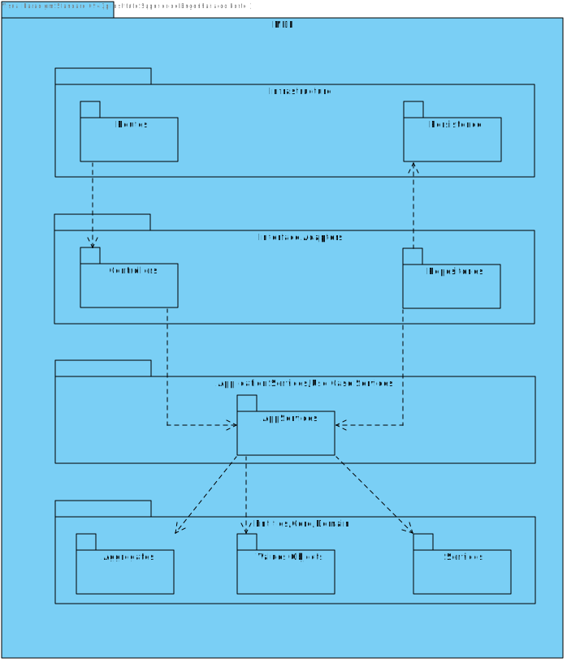
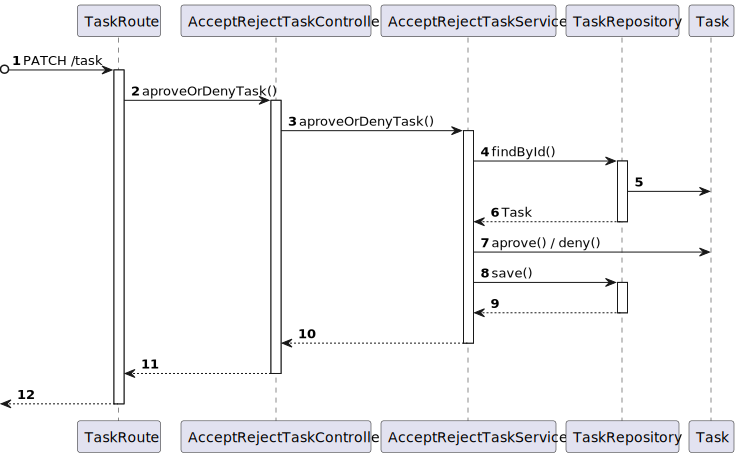

# US 470 - As a Task manager, I pretend to aprove or deny a requisition

## 1. Context

* First time that this user story is being implemented.
* This task is relative to system user.

## 2. Requirements

**US 470-** As a Task manager, I pretend to aprove or deny a requisition

**Dependencies:**

**US 460 -** As the system user I intend to request a task, specify the parameters necessary for its execution,
namely the starting point and term point and what is the intended task

## 3. Analysis

**Analyzing this User Story we understand that:**

As a Task manager, an actor of the system, I should have the possibility to see every task which hasn't been
aprove or denied and aprove or deny those tasks.

### 3.1. Domain Model Excerpt


## 4. Design

For this use case we will implement a service which will receive the id of that task and update its state,
to aprove or denied.

### 4.1. Realization

### Level1

#### LogicalView


#### SceneryView


#### ProcessView


### Level2

#### LogicalView


#### ImplementationView


#### PhysicalView


#### ProcessView


### Level3

#### LogicalView


#### ImplementationView



#### ProcessView



### 4.3. Applied Patterns

* Controller
* Service
* Repo
* Dto

### 4.4. Tests

```ts
describe('acceptRejectTask', () => {

  const pendingTaskDto = {
    taskDescription: "Test Description",
    taskType: "Floor surveillance",
    taskPickupRoom: "B101",
    taskDeliveryRoom: "B103",
    taskBuilding: "B",
    taskFloor: 11,
    taskContact: "912913914",
    taskRequester: "utente@isep.ipp.pt",
    taskRequestDate: new Date()
  } as CreateTaskDTO

  const pendingTask = Task.create(pendingTaskDto)

  const pendingTaskDto2 = {
    taskDescription: "Test Description",
    taskType: "Floor surveillance",
    taskPickupRoom: "B101",
    taskDeliveryRoom: "B103",
    taskBuilding: "B",
    taskFloor: 11,
    taskContact: "912913914",
    taskRequester: "utente@isep.ipp.pt",
    taskRequestDate: new Date()
  } as CreateTaskDTO

  const pendingTask2 = Task.create(pendingTaskDto2)

  beforeEach(() => {
    Container.reset()

    let taskSchema = require('../../../src/persistence/schemas/TaskSchema').default
    Container.set('taskSchema', taskSchema)

    let taskRepoClass = require('../../../src/repos/TaskRepo').default
    let taskRepoInstance = Container.get(taskRepoClass)
    Container.set('TaskRepo', taskRepoInstance)

    let acceptRejectTaskServiceClass = require('../../../src/services/task/AcceptRejectTaskService').default
    let acceptRejectTaskServiceInstance = Container.get(acceptRejectTaskServiceClass)
    Container.set('AcceptRejectTaskService', acceptRejectTaskServiceInstance)
  })

  it('1. should return true if task is accepted', async () => {
    const task = pendingTask.getValue()
    const taskRepo = Container.get('TaskRepo')
    sinon.stub(taskRepo, 'findById').returns(new Promise((resolve, reject) => {
      resolve(task)
    }))
    sinon.stub(taskRepo, 'save').returns(null)
    const service = Container.get('AcceptRejectTaskService') as AcceptRejectTaskService
    const result = await service.acceptOrRejectTask({ taskID: task.id.toString(), accept: true })
    sinon.assert.match(result.isSuccess, true)
  })

  it('2. should return true if task is rejected', async () => {
    const task = pendingTask2.getValue()
    const taskRepo = Container.get('TaskRepo')
    sinon.stub(taskRepo, 'findById').returns(new Promise((resolve, reject) => {
      resolve(task)
    }))
    sinon.stub(taskRepo, 'save').returns(null)
    const service = Container.get('AcceptRejectTaskService') as AcceptRejectTaskService
    const result = await service.acceptOrRejectTask({ taskID: task.id.toString(), accept: false })
    sinon.assert.match(result.isSuccess, true)
  })

  it('3. should return false if task is already accepted', async () => {
    const task = pendingTask.getValue()
    const taskRepo = Container.get('TaskRepo')
    sinon.stub(taskRepo, 'findById').returns(new Promise((resolve, reject) => {
      resolve(task)
    }))
    sinon.stub(taskRepo, 'save').returns(null)
    const service = Container.get('AcceptRejectTaskService') as AcceptRejectTaskService
    const result = await service.acceptOrRejectTask({ taskID: task.id.toString(), accept: false })
    sinon.assert.match(result.isSuccess, false)
  })

  it('4. should return false if task is already rejected', async () => {
    const task = pendingTask2.getValue()
    const taskRepo = Container.get('TaskRepo')
    sinon.stub(taskRepo, 'findById').returns(new Promise((resolve, reject) => {
      resolve(task)
    }))
    sinon.stub(taskRepo, 'save').returns(null)
    const service = Container.get('AcceptRejectTaskService') as AcceptRejectTaskService
    const result = await service.acceptOrRejectTask({ taskID: task.id.toString(), accept: false })
    sinon.assert.match(result.isSuccess, false)
  })

  it('5. should return false if task is not found', async () => {
    const taskRepo = Container.get('TaskRepo')
    sinon.stub(taskRepo, 'findById').returns(new Promise((resolve, reject) => {
      resolve(null)
    }))
    sinon.stub(taskRepo, 'save').returns(null)
    const service = Container.get('AcceptRejectTaskService') as AcceptRejectTaskService
    const result = await service.acceptOrRejectTask({ taskID: "1234", accept: false })
    sinon.assert.match(result.isSuccess, false)
  })


})
```

## 5. Implementation

### Service

```ts
@Service()
export default class AcceptRejectTaskService implements IAcceptRejectTaskService {

    constructor(
        @Inject(config.repos.task.name) private taskRepo: ITaskRepo
    ) { }

    public async acceptOrRejectTask(dto: AcceptRejectTaskDTO): Promise<Result<boolean>> {
        const task = await this.taskRepo.findById(dto.taskID);
        if (task === null) return Result.fail<boolean>("Task not found");
        if (task.taskState === TaskState.Accepted || task.taskState === TaskState.Rejected) return Result.fail<boolean>("Task already accepted or rejected")
        dto.accept ? task.acceptTask() : task.rejectTask();
        this.taskRepo.save(task);
        return Result.ok<boolean>(true)
    }
}
```

### Controller

```ts
@Service()
export default class AcceptRejectTaskController implements IAcceptRejectTaskController {
    
    constructor(
        @Inject(config.services.auth.name) private authService: IAuthService,
        @Inject(config.services.acceptRejectTask.name) private taskService: IAcceptRejectTaskService
    ) 
    {}

    public async acceptRejectTask(req: Request, res: Response, next: NextFunction) {
        if(!this.authService.validateToken(req)){
            return res.status(401).send("Unauthorized");
        }

        //@ts-ignore
        let userRole = req.userRole;
        if(!this.authService.validatePermission(userRole, ["TaskManager"])){
            return res.status(401).send("Unauthorized");
        }

        try {
            const dto = req.body as AcceptRejectTaskDTO
            const result = await this.taskService.acceptOrRejectTask(dto)
            if(result.isFailure) {
                return res.status(400).send(result.errorValue())
            }
            return res.status(200).send(result.getValue())
        }catch (e){
            return next(e);
        }
    }
}
```

## 6. Integration/Demonstration
