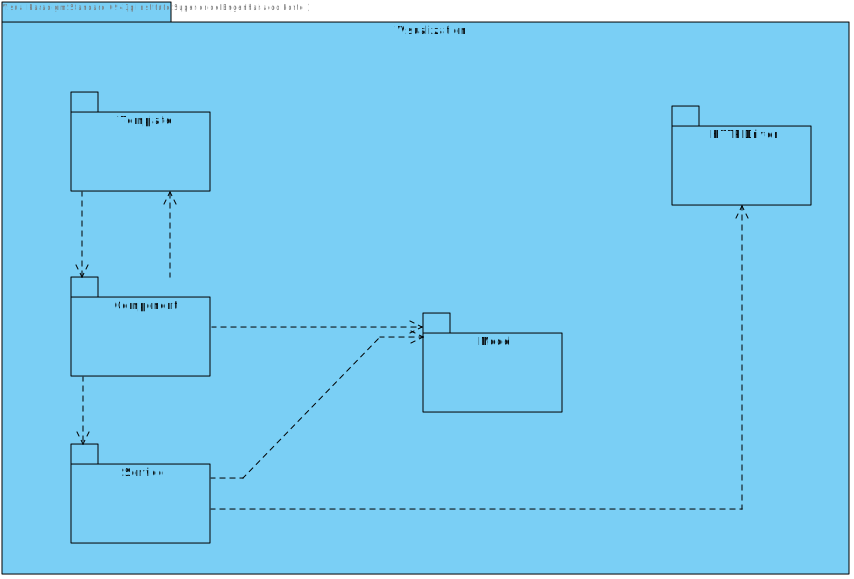
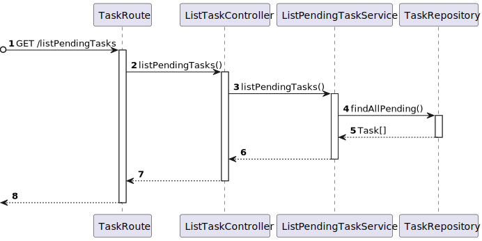

# US 480 - As a task manager, I want to search for all pending tasks.

## 1. Context

* First time that this user story is being implemented.
* This task is relative to the task manager.

## 2. Requirements

**US 480 -** As a task manager, I want to search for all pending tasks.

**Dependencies:**
- US 460 - As the system user I intend to request a task, specify the parameters necessary for its execution, namely the starting point and term point and what is the intended task

### Client Questions
> **Q**:  pretendido é consultar as requisições de tarefas que ainda não foram aprovadas, nem recusadas (ou seja, apresentar só as "pendentes"). Ou se seria pretendido consultar as tarefas "pendentes" + as tarefas recusadas. <br>
> **A**: pretende-se a listagem das requisições pendentes de decisão" <br>

> **Q**: As requisições recusadas também contam como ainda não aprovadas ou apenas as requisições pendentes de aprovação/recusacão.  <br>
> **A**:esta opção deve mostrar ao utilizador as requisções que ainda não tiveram qualquer tipo de decisão: aprovação/recusa. <br>

## 3. Analysis

**Analyzing this User Story we understand that:**
* The task manager is the user who is responsible for managing the tasks.
* The task manager can search for all pending tasks that have not yet been approved or rejected.

### 3.1. Domain Model Excerpt


## 4. Design

### 4.1. Realization

### Level1
###### LogicalView:


###### SceneryView:


###### ProcessView:


#### Level2

###### LogicalView:


###### ImplementationView:


###### PhysicalView:


###### ProcessView:


#### Level3
###### LogicalView:


###### ImplementationView:


###### ProcessView:



### 4.2. Applied Patterns

* Controller
* Service
* Repo
* Dto

### 4.3. Tests

**Test 1:** **Tests the controller using a stub service with a valid user.**
```
it('1. controller with stub service valid', async () => {
    const task = pendingTask.getValue()
    const task2 = pendingTask2.getValue()

    const result = [task, task2]

    let body = { };
    let req: Partial<Request> = {};
    req.body = body;
    req.params = {
      userRole: "TaskManager",
      userEmail: "taskmanager@isep.ipp.pt",
      robotTypeID: "1",
      taskState: "Pending",
      user: "utente@isep.ipp.pt",
      initialDate: "null",
      finalDate: "null",
    }
      let res: Partial<Response> = {
      json: sinon.spy(),
      status: sinon.stub().returnsThis(),
      send: sinon.spy()
    };
    let next: Partial<NextFunction> = () => { }

    let authServicesInstance = Container.get("authService");
    sinon.stub(authServicesInstance, "validateToken").returns(true);
    sinon.stub(authServicesInstance, "validatePermission").returns(true);

    const listPendingTaskService = Container.get('listTaskService')
    sinon.stub(listPendingTaskService, 'listPendingTasks').returns(new Promise((resolve, reject) => {
      resolve(Result.ok<Task[]>(result))
    }))

    const controller = Container.get('listTasksController') as ListTaskController

    await controller.listPendingTasks(<Request>req, <Response>res, <NextFunction>next)

    sinon.assert.calledOnce(res.status)
    sinon.assert.calledWith(res.status, 200)
    sinon.assert.calledOnce(res.json)
    sinon.assert.calledWith(res.json, sinon.match(result))
  })
```

**Test 2:** **Tests the controller using a stub service but no tasks.**
```
it('2. controller with stub service no tasks', async () => {
    let req: Partial<Request> = {}
    let res: Partial<Response> = {
      status: sinon.stub().returnsThis(),
      send: sinon.spy()
    }
    let next: Partial<NextFunction> = () => { }

    const listPendingTaskService = Container.get('listTaskService') as ListPendingTaskService
    sinon.stub(listPendingTaskService, 'listPendingTasks').returns(new Promise((resolve, reject) => {
      resolve(Result.fail<Task[]>('null'))
    }))

    const controller = Container.get('listTasksController') as ListTaskController

    await controller.listPendingTasks(<Request>req, <Response>res, <NextFunction>next)

    sinon.assert.calledOnce(res.status)
    sinon.assert.calledWith(res.status, 400)
    sinon.assert.calledOnce(res.send)
  })
```

**Test 3:** **Tests the service with a valid stub repo.**
```
it('3. Service with stub repo valid', async () => {
    const task = pendingTask.getValue()
    const task2 = pendingTask2.getValue()

    const taskRes1 =TaskMap.toDto(task)
    const taskRes2 =TaskMap.toDto(task2)

    const expected = [taskRes1, taskRes2]

    const repoReturns = [task, task2]

    const taskRepo = Container.get('TaskRepo')
    sinon.stub(taskRepo, 'findAllPending').returns(new Promise((resolve, reject) => {
      resolve(repoReturns)
    }))

    const listPendingTaskService = Container.get('listTaskService') as ListPendingTaskService
    const result = await listPendingTaskService.listPendingTasks()

    sinon.assert.match(result.getValue(), expected)
  })
```

**Test 4:** **Tests the service with a valid stub repo but no tasks.**
```
it('4. Service with stub repo no tasks', async () => {
    const taskRepo = Container.get('TaskRepo')
    sinon.stub(taskRepo, 'findAllPending').returns(new Promise((resolve, reject) => {
      resolve([])
    }))

    const listPendingTaskService = Container.get('listTaskService') as ListPendingTaskService
    const result = await listPendingTaskService.listPendingTasks()

    sinon.assert.match(result.isFailure, true)
  })
```

**Test 5:** **Tests the controller and service integration using a valid stub repo.**
```
it('5. Controller + Service with stub repo valid', async () => {
    const task = pendingTask.getValue()
    const task2 = pendingTask2.getValue()

    const taskRes1 =TaskMap.toDto(task)
    const taskRes2 =TaskMap.toDto(task2)

    const expected = [taskRes1, taskRes2]

    const repoReturns = [task, task2]

    let req: Partial<Request> = {}
    let res: Partial<Response> = {
      status: sinon.stub().returnsThis(),
      json: sinon.spy()
    }
    let next: Partial<NextFunction> = () => { }

    const taskRepo = Container.get('TaskRepo')
    sinon.stub(taskRepo, 'findAllPending').returns(new Promise((resolve, reject) => {
      resolve(repoReturns)
    }))

    const listPendingTaskService = Container.get('listTaskService') as ListPendingTaskService
    const controller = Container.get('listTasksController') as ListTaskController

    await controller.listPendingTasks(<Request>req, <Response>res, <NextFunction>next)

    sinon.assert.calledOnce(res.status)
    sinon.assert.calledWith(res.status, 200)
    sinon.assert.calledOnce(res.json)
    sinon.assert.calledWith(res.json, sinon.match(expected))
  })
```

**Test 6:** **Tests the controller and service integration using a valid stub repo but no tasks.**
```
it('6. Controller + Service with stub repo no tasks', async () => {
    const taskRepo = Container.get('TaskRepo')
    sinon.stub(taskRepo, 'findAllPending').returns(new Promise((resolve, reject) => {
      resolve([])
    }))

    let req: Partial<Request> = {}
    let res: Partial<Response> = {
      status: sinon.stub().returnsThis(),
      send: sinon.spy()
    }
    let next: Partial<NextFunction> = () => { }

    const listPendingTaskService = Container.get('listTaskService') as ListPendingTaskService
    const controller = Container.get('listTasksController') as ListTaskController

    await controller.listPendingTasks(<Request>req, <Response>res, <NextFunction>next)

    sinon.assert.calledOnce(res.status)
    sinon.assert.calledWith(res.status, 400)
    sinon.assert.calledOnce(res.send)
  })
```

## 5. Implementation

#### Controller
```
public async listPendingTasks(req: Request, res: Response, next: NextFunction) {
        if(!this.authService.validateToken(req)){
            return res.status(401).send("Unauthorized");
        }

        //@ts-ignore
        let userRole = req.userRole;
        if(!this.authService.validatePermission(userRole, ["TaskManager"])){
            return res.status(401).send("Unauthorized");
        }

        try {
            const taskOrError = await this.taskService.listPendingTasks()

            if (taskOrError.isFailure) {
                return res.status(400).send()
            }

            const taskDTO = taskOrError.getValue();
            return res.status(200).json(taskDTO);

        }catch (e){
            return next(e);
        }
    }
```

#### Service
```
export default class ListPendingTaskService implements IListPendingTaskService{

  constructor(@Inject(config.repos.task.name) private taskRepo: ITaskRepo) {
  }

  public async listPendingTasks(): Promise<Result<ITaskDTO[]>> {
    const tasks = await this.taskRepo.findAllPending();

    if(tasks.length === 0){
      return Result.fail<ITaskDTO[]>("No tasks found")
    }

    let resolve: ITaskDTO[] = []

    tasks.forEach(t => {
      resolve.push(TaskMap.toDto(t))
    })

    return Result.ok<ITaskDTO[]>(resolve)
  }

}
```

#### Repo
```
public async findAllPending(): Promise<Task[]> {
    const query = { taskState: "Pending" };
    const taskRecord = await this.taskSchema.find(query as FilterQuery<ITaskPersistence & Document>);
    let tasks: Task[] = [];
    for (const element of taskRecord) {
      const task = await TaskMap.toDomain(element);
      tasks.push(task);
    }
    return tasks;
  }
```

## 6. Integration/Demonstration

To show this functionality the user needs to authenticated in the system as a task manager. Then, the user needs to click on the "Pending Tasks" button in the menu. After logging in, the user needs to select the "Pending Tasks" option in the menu. The user will be presented with a list of all pending tasks automatically.

## 7. Observations

No observations.
